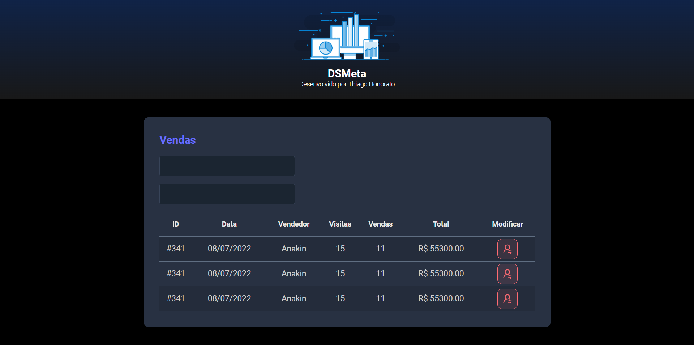

<h1 align="center"> DSMeta - CSS </h1>

Página web criada na semana de preparação para a Semana Spring Boot React, ministrado pelo prof. Nélio Alves, servindo de base HTML/CSS do projeto DSMeta. 

  <a href="#-tecnologias">Tecnologias</a>&nbsp;&nbsp;&nbsp;|&nbsp;&nbsp;&nbsp;
  <a href="#-projeto">Projeto</a>&nbsp;&nbsp;&nbsp;|&nbsp;&nbsp;&nbsp;
  <a href="#-layout">Layout</a>&nbsp;&nbsp;&nbsp;|&nbsp;&nbsp;&nbsp;
  <a href="#memo-licença">Licença</a>

 

  

## 🚀 Tecnologias

Esse projeto foi desenvolvido com as seguintes tecnologias:

- HTML 
- CSS

## 💻 Projeto

O projeto é uma página da web que simula a página inicial de um sistema de controle de vendas, este projeto serviu de base para o projeto completo DSMeta.

## 🔖 Layout

Você pode navegar pelo projeto através [DESSE LINK](https://thiagomonts.github.io/dsmeta-css/).

## :memo: Licença

Esse projeto está sob a licença MIT.

---

Desenvolvido por [Thiago Honorato](https://www.linkedin.com/in/honoratothiago/)
